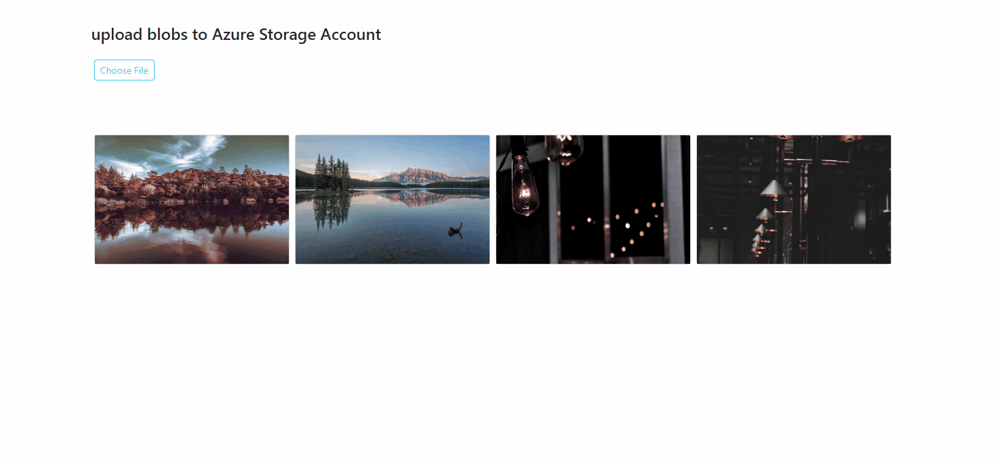
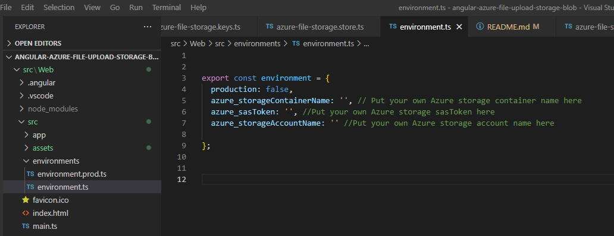
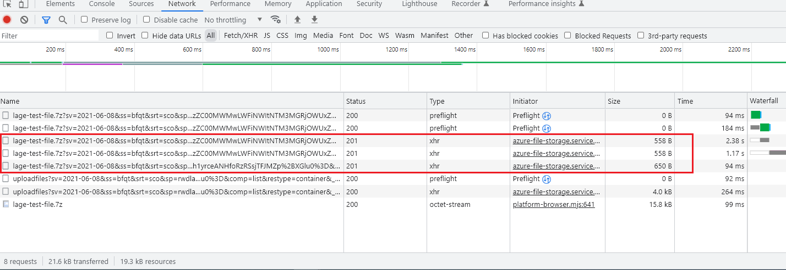

# angular-azure-file-upload-storage-blob

The purpose of this demo code is to practice and learn how to upload / get / delete blob files to Azure Storage Blobs with Angular.


The project is build with:
- Angular V14.2.0
- Bootstrap V5.2.2
- ngrx V14.3.2
- @azure/storage-blob V12.12.0

# Description
The user:
- Select one file (image) from the file system
- Upload the file to Azure Storage Blobs. If the file is large, uploading the big file in chunks and show one progress bar to indicate the uploading progress.
- Delete the file from Azure Storage Blobs

Here is the demo:


# Getting Started

## Required Software
- Node V16.15.0
- Angular V14.2.0
- Azure Storage Account, [【refer from here】](https://learn.microsoft.com/en-us/azure/storage/common/storage-account-create?tabs=azure-portal)
- Azure Blob container, [【refer from here】](https://learn.microsoft.com/en-us/azure/storage/blobs/blob-containers-portal)

## Setup/Installation
```js
npm install
npm start
```

One more thing you need to do is to include the your won Azure account information in the ```environment.ts``` file.


Otherwise you will see: Azure Storage is not configured UI


Once the project runs up, you can visit the page from http://localhost:4321/


Try to uplod a big file, you will see Azure uploading the big file in chunks and we can use ```onProgress``` callback to show a progress bar to indicate the uploading progress.


In this demo, upload one zip file, the zip file has been uploaded in 3 chunks:



For more Azure Storage blob usage, you can refer [Upload a blob to Azure Storage by using the JavaScript client library](https://learn.microsoft.com/en-us/azure/storage/blobs/storage-blob-upload-javascript)